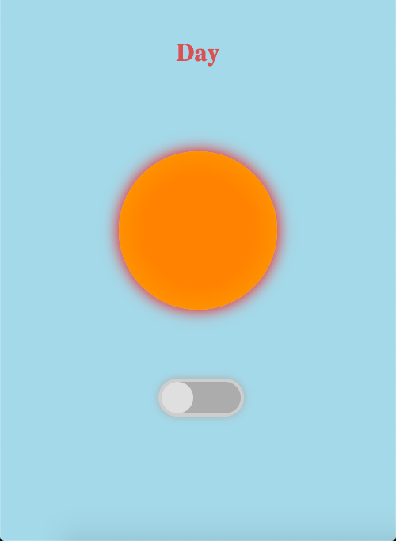
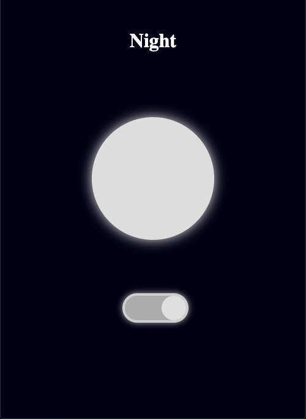

# Toggle Meridiem

## How To Open
> 1. Go to the application's download folder
> 2. Right click on the file named _index.html_
> 3. Choose the _open with_ option
> 4. Open the application in your desired browser

## How To Use
> 1. Press the toggle widget to change the time of day

## Requirements
> - This application requires a browser to run
> - The browser must have JavaScript available and enabled

## Errors
> - N/A

## Extra Information
> - N/A

## Preview

